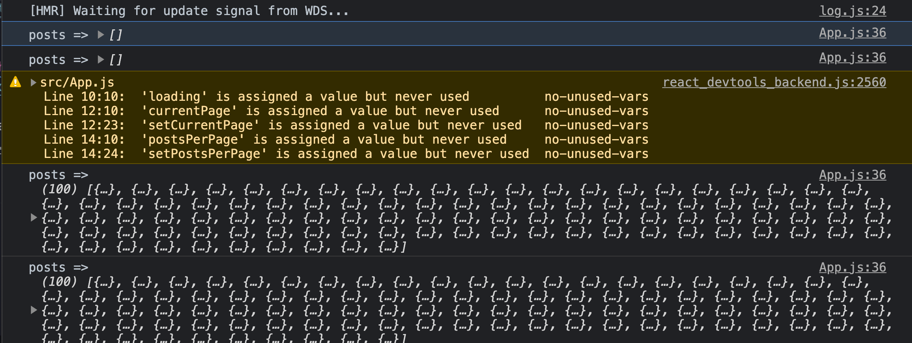

# [React Pagination](https://www.youtube.com/watch?v=IYCa1F-OWmk)

- [post from jsonplaceholder](https://jsonplaceholder.typicode.com/posts)

- style cdn bootstrap added index.html (https://react-bootstrap.github.io/getting-started/introduction/)

## how jsonplaceholder post data look like

```json
[
{
"userId": 1,
"id": 1,
"title": "sunt aut facere repellat provident occaecati excepturi optio reprehenderit",
"body": "quia et suscipit\nsuscipit recusandae consequuntur expedita et cum\nreprehenderit molestiae ut ut quas totam\nnostrum rerum est autem sunt rem eveniet architecto"
},
{
"userId": 1,
"id": 2,
"title": "qui est esse",
"body": "est rerum tempore vitae\nsequi sint nihil reprehenderit dolor beatae ea dolores neque\nfugiat blanditiis voluptate porro vel nihil molestiae ut reiciendis\nqui aperiam non debitis possimus qui neque nisi nulla"
},
{}, {}, ...]
```

- install axios()

### understand variable posts in useState([])

- default value for posts is `[]`

```js
  // create state values
  const [posts, setPosts] = useState([]);

  // same as setting empty obj to key posts inside of state obj
  state = {
    posts: []
  }
```

- we have api call therefore create another state management for loading.  default value is `false`.

```js
const [loading, setLoading] = useState(false);
```

- Quick react snippets
`racf` - arrow function component

## why do we use `loading` useState()?



- We wrap 
`setLoading(true)`
for `await axios.get(url)`
then close it off with `setLoading(false)`

This ensures posts data has been loaded. 

- add Spinner for while data is loading: 
* Spinner: https://bit.dev/joshk/react-spinners-css/facebook, https://github.com/JoshK2/react-spinners-css

- Step 1) install [npm react spinner css](https://www.npmjs.com/package/react-spinners-css):
  > npm i react-spinners-css

- Step 2) add any Spinner loading gif
  ex) <Heart/>

```js
import { Heart } from 'react-spinners-css';


export const Posts = ({ posts, loading }) => {
  if ( loading ) {
    // If the posts are loading, show a spinner
    return <Heart />;
  }

  return (
    <div>
      
    </div>
  )
}

```

### bootstrap list group

https://react-bootstrap.github.io/components/list-group/


https://getbootstrap.com/docs/4.0/components/list-group/

- `mb-4` boostrap utility: margin bottom 4

```jsx
<ListGroup>
  <ListGroup.Item>Cras justo odio</ListGroup.Item>
  <ListGroup.Item>Dapibus ac facilisis in</ListGroup.Item>
  <ListGroup.Item>Morbi leo risus</ListGroup.Item>
  <ListGroup.Item>Porta ac consectetur ac</ListGroup.Item>
  <ListGroup.Item>Vestibulum at eros</ListGroup.Item>
</ListGroup>

// or use regular bootstrap

<ul class="list-group">
  <li class="list-group-item">Cras justo odio</li>
  <li class="list-group-item">Dapibus ac facilisis in</li>
  <li class="list-group-item">Morbi leo risus</li>
  <li class="list-group-item">Porta ac consectetur ac</li>
  <li class="list-group-item">Vestibulum at eros</li>
</ul>
```

### logic to calculate the currentPosts index

```jsx
// Get Current posts, currentPage ex: pg 1, postPerPage ex: 10 posts/pg 
  //  result in last index => 10
  const indexOfLastPost = currentPage * postsPerPage;
  const indexOfFirstPost = indexOfLastPost - postsPerPage;
  // .slice(start, stop) indexOfLastPost not included .slice(0, 10)
  //  => currentPosts i from 0 to 9 shallow copy of orig array
  const currentPosts = posts.slice(indexOfFirstPost, indexOfLastPost);
  // console.log('posts =>', posts);  // => 100 posts
  return (
    <div className="container mt-5">
      <h1 className="text-primary mb-3">My Blog</h1>
      <Posts posts={currentPosts} loading={loading} />
    </div>
  );
};
```

- [bootstrap styling for pagination](https://getbootstrap.com/docs/4.0/components/pagination/)

```jsx
<nav aria-label="Page navigation example">
  <ul class="pagination">
    <li class="page-item"><a class="page-link" href="#">Previous</a></li>
    <li class="page-item"><a class="page-link" href="#">1</a></li>
    <li class="page-item"><a class="page-link" href="#">2</a></li>
    <li class="page-item"><a class="page-link" href="#">3</a></li>
    <li class="page-item"><a class="page-link" href="#">Next</a></li>
  </ul>
</nav>
```

- credits: 
* TraversyMedia Pagination: https://youtu.be/IYCa1F-OWmk
https://www.youtube.com/c/TraversyMedia/playlists

* Codevolution https://www.youtube.com/watch?v=QFaFIcGhPoM&list=PLC3y8-rFHvwgg3vaYJgHGnModB54rxOk3

* using React Paginate library (PedroTech)
https://www.youtube.com/watch?v=HANSMtDy508

## second time practice
1. Inside of `index.html` add bootstrap cdn 
2. Start at `App.js`
3. Install `axios` for fetch JSONPlaceholder api call

- Axios call
* Step 1) useState, set posts to empty array
```js
state = {
    posts: []
}

// same for 

const [posts, setPosts] = useState([]);

```

- When does `useEffect` run?
  1. component mounts
  2. when updates component, fetchPosts will keep updating the component.  Infinite loop.  To stop that, we pass empty dependency array as the 2nd argument of `useEffect()`. 

